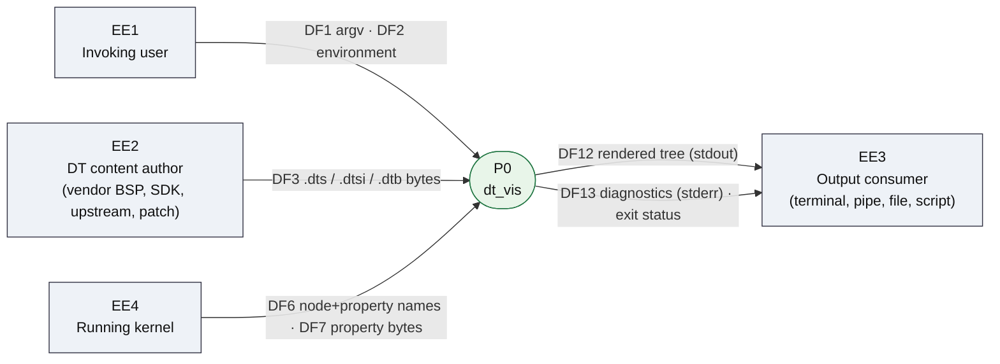
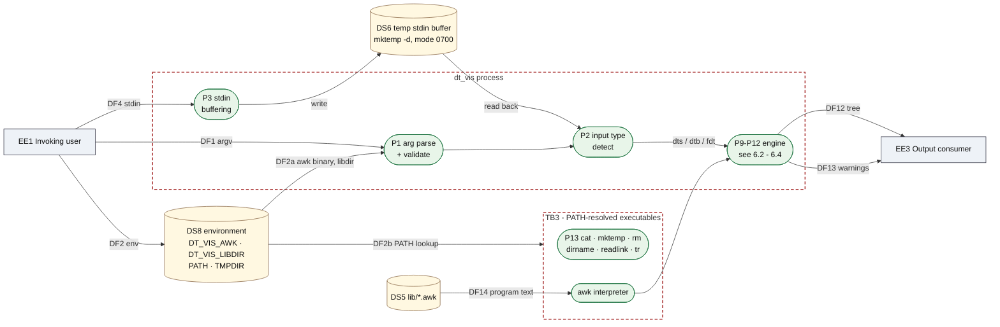
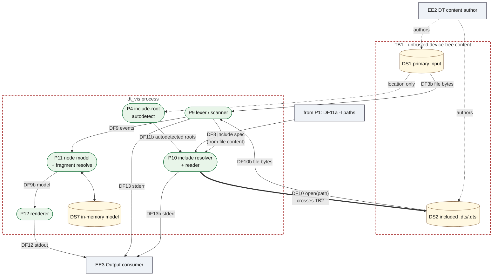
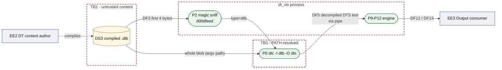
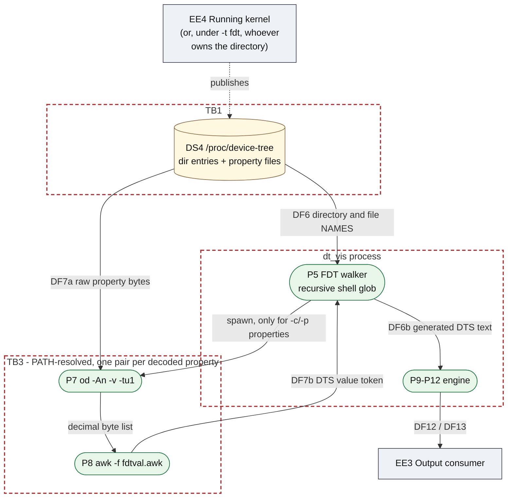
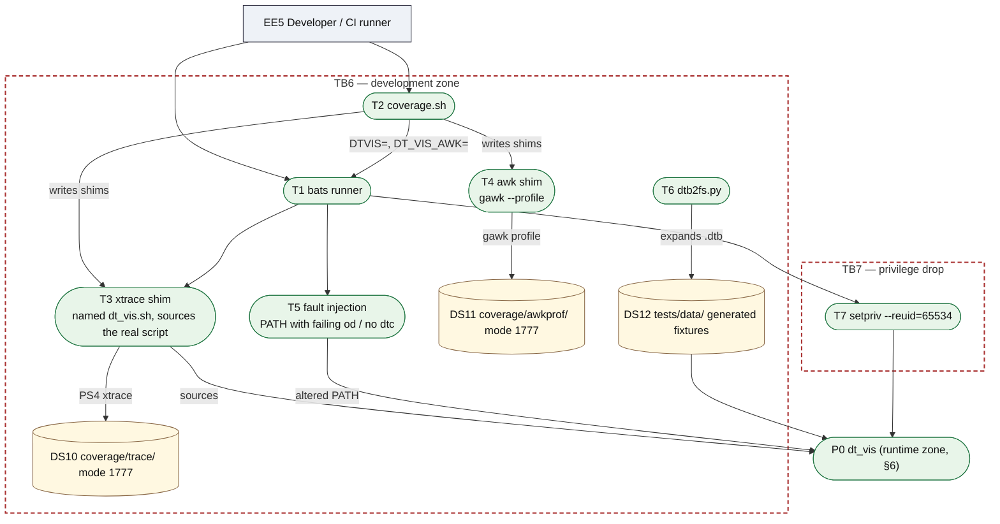

# dt_vis — system model for threat modelling

This document is the **system model only**: the decomposition, the trust
boundaries, the element inventory and the data-flow annotations that a
STRIDE (or LINDDUN, or attack-tree) pass consumes. It deliberately states
*what is*, not *what could go wrong* — the threat enumeration is left to the
review session so that it is not anchored by someone else's conclusions.

Section 11 is a blank STRIDE worksheet keyed to the element IDs below.

Version: matches `dt_vis.sh` 1.0.0 / `lib/dts2tree.awk` with include
following. Revisit whenever a new input source, a new spawned process, a new
environment variable, or a new file-opening code path is added — those are
the four changes that move a boundary.

---

## 1. How to use this

1. Read §3 (assets) and §4 (trust boundaries) first — they set what "bad"
   means for this system.
2. Work the L1 diagram (§6) element by element using the inventory in §8.
3. For each element, walk the STRIDE letters that apply to its type (§11).
4. For each data flow, the two columns that matter are **who controls the
   bytes** and **what validation is applied** — both are stated factually in
   §8.4.
5. Check your findings against the assumptions in §9. A finding that
   contradicts a listed assumption is either a real gap or a sign the
   assumption is wrong; both are worth recording.

---

## 2. Scope

### In scope

| Zone | Contents |
|---|---|
| **Runtime zone** | `dt_vis.sh`, `lib/dts2tree.awk`, `lib/fdtval.awk`, the three input back-ends, and every process they spawn |
| **Development zone** | `tests/*.bats`, `tests/run_tests.sh`, `tools/coverage.sh` and its shims, `tests/tools/dtb2fs.py` |

The two zones are modelled separately (§6, §7) because they run under
different assumptions: the dev zone deliberately manipulates `PATH`, replaces
the entry-point script, enables `xtrace`, relaxes directory permissions and
drops privileges — all of which would be findings in the runtime zone and are
design intent in the dev zone.

### Out of scope

* **Supply chain.** How `dtc`, `awk`, `bats` and this repository arrive on
  the machine. Their integrity is assumed (A2, A4).
* **Vulnerabilities inside third-party binaries.** A bug in `dtc`'s own
  parser is `dtc`'s problem; *how dt_vis invokes it* is in scope.
* **The host OS**, its DAC/MAC policy, and the kernel's own exposure of
  `/proc/device-tree`.
* **The device tree specification** and whether a given tree is a sane
  hardware description.

---

## 3. Assets and security objectives

| ID | Asset | Objective | Why it matters here |
|---|---|---|---|
| AS1 | **Integrity of the rendered tree** | The output faithfully represents the input | This is the product. A developer makes driver, address-map and enablement decisions from it; a subtly wrong tree is worse than no tool |
| AS2 | **Confidentiality of the invoking user's files** | The tool reads only what the user intended it to read | With `-i`, file *content* selects further files to open (DF10) |
| AS3 | **Integrity of the invoking user's account** | No execution of anything the user did not intend | The tool spawns four to five external programs (§8.2) |
| AS4 | **Availability of the developer's session** | Bounded time and memory for any input | Interactive tool; also used in scripts and pipelines |
| AS5 | **Integrity of the controlling terminal** | Output does not alter the state of the consumer | stdout carries text derived from input bytes (DF12) |
| AS6 | **Integrity of the source tree being inspected** | The tool does not modify what it reads | Read-only by design; one write target exists (DS6) |

---

## 4. Trust boundaries

| ID | Boundary | What crosses it | Direction |
|---|---|---|---|
| **TB1** | Device-tree content ↔ parser | All bytes of DS1, DS2, DS3, DS4 | inbound |
| **TB2** | Process ↔ filesystem read scope | File opens, bounded by the invoking user's credentials, *selected* partly by file content | outbound (opens), inbound (bytes) |
| **TB3** | Process ↔ spawned executables | Program lookup via `PATH`; argv and stdin partly derived from untrusted content | bidirectional |
| **TB4** | Process ↔ output consumer | stdout byte stream, stderr byte stream, exit status | outbound |
| **TB5** | Invoking user ↔ process | argv, environment, cwd, controlling terminal | inbound |
| **TB6** | Runtime zone ↔ development zone | Replaced entry point, altered `PATH`, `xtrace` stream, relaxed directory modes | bidirectional, dev-only |
| **TB7** | Privilege drop inside the dev zone | `setpriv --reuid=65534 --regid=65534` for one test | dev-only |

TB1 is the boundary that gives this tool a threat model at all. A `.dts`,
`.dtsi` or `.dtb` typically originates outside the reader's organisation — a
silicon vendor BSP, a downloaded SDK, a git submodule, a patch on a mailing
list, an attachment. The user chooses *which* file to open; the *content* of
that file is not the user's.

---

## 5. DFD Level 0 — context

Boundaries crossed: `EE1→P0` is **TB5**; `EE2→P0` and `EE4→P0` are **TB1**;
`P0→EE3` is **TB4**.

---

## 6. DFD Level 1 — runtime zone

The runtime zone is drawn as four views rather than one. A single diagram
containing all thirteen processes is unreadable, and the three input
back-ends are independent paths that share one engine — so analysing them one
at a time is also the more natural way to work.

Dashed boxes are trust boundaries. Rounded = process, cylinder = data store,
rectangle = external entity.

### 6.1 Spine — input selection and shared services

`EE1 -> P1/P3` and `EE1 -> DS8` cross **TB5**. `DS8 -> EXEC` crosses **TB3**
and **TB5** together: the environment decides which binary is run.

### 6.2 DTS source path (the `-i` path is here)

The only path where the content of a file decides which further files are
opened.

The thick edge is the loop worth staring at: bytes read from DS1 select a
path, that path is opened, and its bytes re-enter the same lexer. Without
`-i`, P10 is inert and the loop does not exist.

### 6.3 Compiled blob path

Note that the untrusted bytes cross **TB3** into `dtc` before they cross
**TB1** into our own parser: `dtc` is the first thing that reads them.

### 6.4 Device-tree filesystem path

This is the only path that *synthesises* DTS text rather than reading it:
directory and file names taken from DS4 become node and property names in a
generated stream that the engine then parses (DF6).

---

## 7. DFD Level 1 — development zone

Runs only from `tests/run_tests.sh`, `bats tests/` or `tools/coverage.sh`.
Never present in an installed copy.

Dev-zone facts a reviewer should have:

* `tools/coverage.sh` replaces the entry point with a shim that enables
  `set -x` and **sources** `dt_vis.sh`, so the code under measurement is the
  real file but `$0` and the process image are the shim's.
* `coverage/trace/` and `coverage/awkprof/` are `chmod 1777` for the duration
  of a coverage run, so the privilege-dropped test (T7) can still write its
  trace. They live under the repo, not `/tmp`.
* Three tests deliberately manipulate `PATH` to make `od` fail or `dtc`
  disappear.
* `tests/30_backends.bats` regenerates `tests/data/` with `dtc` and
  `dtb2fs.py` on every run.

---

## 8. Element inventory

### 8.1 External entities

| ID | Entity | Trusted? | Controls |
|---|---|---|---|
| EE1 | Invoking user | Assumed to act in their own interest | argv, environment, cwd, which file is opened, controlling terminal |
| EE2 | DT content author | **Not trusted** | Every byte of DS1, DS2, DS3; filenames within an `-t fdt` directory |
| EE3 | Output consumer | n/a (sink) | Interprets stdout — may be a terminal emulator, a pager, a pipe, a file, another program |
| EE4 | Running kernel | Trusted | Contents and layout of `/proc/device-tree` |
| EE5 | Developer / CI runner | Trusted | Dev zone only |

### 8.2 Processes

| ID | Process | Where | Notes |
|---|---|---|---|
| P1 | Argument parse + validate | `dt_vis.sh` `parse_args`/`validate_args` | Enum-validates `--color`, `--type`; numeric-validates `--depth`, `--width`. File path checked only for existence and readability |
| P2 | Input type detection | `dt_vis.sh` `detect_file_type` | Reads first 4 bytes via `od` piped to `tr`; directory ⇒ fdt |
| P3 | stdin buffering | `dt_vis.sh` `main` | `mktemp -d` (mode 0700) then `cat > $d/stdin`; removed by an EXIT/INT/TERM trap |
| P4 | Include-root autodetect | `dt_vis.sh` `detect_kernel_includes` | Walks up from the input file's directory looking for `scripts/dtc/include-prefixes` |
| P5 | FDT walker | `dt_vis.sh` `fdt_walk`/`fdt_to_dts` | Recursive shell glob; emits generated DTS text on stdout of a pipeline |
| P6 | `dtc` | external binary | `dtc -I dtb -O dts -q -q -q -- "$src"`; only for dtb input |
| P7 | `od` | external binary | `od -An -tx1 -N4` (magic) and `od -An -v -tu1` (property bytes) |
| P8 | `awk -f lib/fdtval.awk` | external interpreter + our program | One process **per decoded property**; only for properties named by `-c`/`-p` |
| P9 | Lexer / scanner | `lib/dts2tree.awk` `process_line`/`strip_comments`/`scan` | Runs in the same awk process as P10–P12 |
| P10 | Include resolver + reader | `lib/dts2tree.awk` `do_include`/`resolve_include`/`drain_includes` | Only active with `-i`. Opens files named by DS1/DS2 content |
| P11 | Node model + fragment resolution | `lib/dts2tree.awk` `get_child`/`merge_node`/`resolve_fragments` | |
| P12 | Renderer | `lib/dts2tree.awk` `render`/`emit_props` | Writes stdout |
| P13 | `cat`, `mktemp`, `rm`, `dirname`, `readlink`, `tr` | external binaries | All resolved through `PATH` |

Process count for a typical run: 2 (bash + awk) for `.dts`; 3 for `.dtb`;
for `-t fdt`, 1 (bash) **plus two processes — one `od`, one `awk` — for every
property named by `-c`/`-p`**, and none for the properties that were not asked for.

### 8.3 Data stores

| ID | Store | Read/Write | Lifetime | Access control |
|---|---|---|---|---|
| DS1 | Primary input file | R | caller-owned | invoking user's credentials |
| DS2 | Included `.dts`/`.dtsi` files | R | caller-owned | invoking user's credentials; *set membership decided by DS1/DS2 content* |
| DS3 | Compiled `.dtb` | R | caller-owned | invoking user's credentials |
| DS4 | Device-tree filesystem | R | kernel-owned | normally world-readable |
| DS5 | `lib/*.awk` program text | R | install-time | located via `DT_VIS_LIBDIR` or resolved relative to the script (symlinks followed) |
| DS6 | Temp stdin buffer | R/W | one run | `mktemp -d`, mode 0700, removed on EXIT/INT/TERM |
| DS7 | In-memory node model | R/W | one run | awk arrays; sized by input |
| DS8 | Process environment | R | one run | `DT_VIS_AWK` (executed), `DT_VIS_LIBDIR` (selects program text), `PATH`, `TMPDIR` |
| DS10 | Coverage trace dir | W | dev only | mode 1777 during a coverage run |
| DS11 | gawk profile dir | W | dev only | mode 1777 during a coverage run |
| DS12 | Generated test fixtures | R/W | dev only | rebuilt each run |

The runtime zone writes to exactly one filesystem location: **DS6**.

### 8.4 Data flows

The two rightmost columns are the ones a STRIDE pass leans on.

| ID | From → To | Crosses | Payload | Content controlled by | Validation / transformation applied |
|---|---|---|---|---|---|
| DF1 | EE1 → P1 | TB5 | argv | user | `--depth`/`--width` numeric; `--color`/`--type` enum; input path: `-e` and `-r` only; `-p` list split on `,`, trimmed, de-duplicated |
| DF2 | EE1 → DS8 → P1 | TB5 | `DT_VIS_AWK`, `DT_VIS_LIBDIR` | user | none — `DT_VIS_AWK` is executed via `command -v` then run; `DT_VIS_LIBDIR` selects the awk program text |
| DF2b | DS8 → EXEC | TB3, TB5 | `PATH` | user/environment | none — all of `awk`, `od`, `dtc`, `cat`, `mktemp`, `rm`, `dirname`, `readlink`, `tr` are resolved by name |
| DF3 | DS1 → P2 | TB1 | first 4 bytes | **author** | compared against `d00dfeed` |
| DF3b | DS1 → P9 | TB1 | whole file | **author** | see DF8 |
| DF4 | EE1 → P3 → DS6 | TB5 | stdin byte stream | user/upstream pipe | none; written verbatim to the temp file |
| DF5 | DS3 → P6 → P9 | TB1, TB3 | `.dtb` in, DTS text out | **author** | `dtc`'s own parser and validation; dt_vis applies none of its own |
| DF6 | DS4 → P5 | TB1 | directory and file **names** | kernel (or, under `-t fdt`, whoever owns the directory) | none — names are interpolated into generated DTS text via `printf '%s {\n'` / `printf '%s = %s;\n'` |
| DF7a | DS4 → P7 | TB1, TB3 | raw property bytes | kernel / directory owner | none |
| DF7b | P7 → P8 → P5 | TB3 | decimal byte list in, DTS value token out | derived from DF7a | type guessed by `dtc`'s `util_is_printable_string` rule; `"` and `\` escaped inside string values; cells/bytes rendered as hex |
| DF8 | P9 lexing | TB1 | line stream | **author** | block/line comments removed (string-aware); cpp directive lines dropped by keyword list; scanner is quote-aware for `{`, `}`, `;` |
| DF9 | P9 → P11 | — | node-open / node-close / statement events | derived from author content | node identity is `(parent, name)`; property split on first `=`; `/delete-*/` applied; unknown `/directives/` counted and ignored |
| DF10 | P9 → P10 → DS2 | **TB1 and TB2** | include spec from file content → an `open()` | **author** (spec) + user (`-I` paths) | spec must end `.dts`/`.dtsi`; path built as `dirname(includer)/spec`, then each `-I` dir, then `basedir`; `normpath()` collapses `.` and `..`; repeats skipped via a seen-set; nesting capped at 100 |
| DF11a | P1 → P10 | TB5 | `-I` search paths | user | none |
| DF11b | P4 → P10 | TB2 | autodetected kernel roots | derived from DS1's **location** | directory-existence check only |
| DF12 | P12 → EE3 | TB4 | rendered tree on stdout | derived from author content: node names, labels, property values | values elided at `-w` (default 48 chars); ANSI SGR sequences added by dt_vis when `--color` resolves to on; no filtering of the input-derived text itself |
| DF13 | P9/P10 → EE3 | TB4 | warnings on stderr | derived from author content: file basenames, line numbers, include specs | none; suppressed entirely by `-q` |
| DF14 | DS5 → P8/P9 | TB2 | awk program text | install (or `DT_VIS_LIBDIR`) | readability check on `dts2tree.awk` only |
| DF15 | P3 ↔ DS6 | TB2 | buffered stdin | user/upstream | directory created by `mktemp -d` (0700); `rm -rf` on EXIT/INT/TERM |

---

## 9. Assumptions

Each is stated so it can be challenged. A finding that violates one of these
is either a real gap or an assumption that needs correcting.

| ID | Assumption |
|---|---|
| A1 | dt_vis runs with the invoking user's privileges. It is not setuid, not a daemon, has no network access and no listening socket |
| A2 | `dt_vis.sh` and `lib/*.awk` on disk are the intended versions (installation integrity is out of scope, §2) |
| A3 | The invoking user chooses *which* input to open, but does **not** control its content. Content is authored by EE2 |
| A4 | `dtc`, `awk`, `od` and the coreutils behave as documented; their own defects are out of scope, their invocation is not |
| A5 | `/proc/device-tree` is kernel-owned and its layout is well-formed. `-t fdt` pointed at any other directory carries no such guarantee |
| A6 | The runtime zone performs exactly one filesystem write (DS6) and no other mutation of the user's disk |
| A7 | Output is consumed by something that interprets a byte stream — commonly a terminal emulator |
| A8 | The dev zone (§7) is never present in an installed copy and is exercised only by a developer or CI on a machine they control |
| A9 | No secrets, credentials or personal data are handled by design. Any sensitive data reachable is incidental — whatever the invoking user's credentials can read |

---

## 10. Execution context

| Property | Value |
|---|---|
| Privilege | Invoking user; no escalation mechanism, no setuid/setgid bit |
| Persistence | None. No config file, no cache, no state directory, no dotfile |
| Network | None |
| IPC | Pipes to spawned children only |
| Signals handled | `EXIT`, `INT`, `TERM` → temp-directory cleanup |
| Shell hardening | `set -o errexit -o nounset -o pipefail`, explicit `IFS`, `LC_ALL=C` |
| Concurrency | Single-threaded; no locking; no shared mutable state between runs |
| Exit status | 0 = tree produced (warnings possible), 2 = usage/IO error, other = propagated from `dtc` |
| Input size bounds | None declared. Node nesting depth, tree width, line length and property count are unbounded; include nesting is capped at 100 |

---

## 11. STRIDE worksheet (blank)

Standard applicability by element type:

| Element type | S | T | R | I | D | E |
|---|:-:|:-:|:-:|:-:|:-:|:-:|
| External entity | ✓ | | ✓ | | | |
| Process | ✓ | ✓ | ✓ | ✓ | ✓ | ✓ |
| Data store | | ✓ | ✓* | ✓ | ✓ | |
| Data flow | | ✓ | | ✓ | ✓ | |

\* repudiation applies to a data store when it is a log.

Work the elements in this order — outside-in, because that is the direction
untrusted bytes travel:

1. **Flows across TB1** — DF3, DF3b, DF5, DF6, DF7a, DF8
2. **Flows across TB2** — DF10, DF11b, DF14, DF15
3. **Flows across TB3** — DF2b, DF5, DF7a/b
4. **Flows across TB4** — DF12, DF13
5. **Flows across TB5** — DF1, DF2, DF4, DF11a
6. **Processes** — P1…P13, with particular attention to any that both parse
   untrusted content and take an action with an external effect
7. **Data stores** — DS1…DS8
8. **Dev zone** — TB6, TB7 and T1…T7

| Element | S | T | R | I | D | E | Threat / note | Existing control | Residual |
|---|---|---|---|---|---|---|---|---|---|
| DF3 |  |  |  |  |  |  |  |  |  |
| DF5 |  |  |  |  |  |  |  |  |  |
| DF6 |  |  |  |  |  |  |  |  |  |
| DF7a |  |  |  |  |  |  |  |  |  |
| DF7b |  |  |  |  |  |  |  |  |  |
| DF8 |  |  |  |  |  |  |  |  |  |
| DF10 |  |  |  |  |  |  |  |  |  |
| DF11b |  |  |  |  |  |  |  |  |  |
| DF12 |  |  |  |  |  |  |  |  |  |
| DF13 |  |  |  |  |  |  |  |  |  |
| DF2 / DF2b |  |  |  |  |  |  |  |  |  |
| P2 |  |  |  |  |  |  |  |  |  |
| P5 |  |  |  |  |  |  |  |  |  |
| P9 |  |  |  |  |  |  |  |  |  |
| P10 |  |  |  |  |  |  |  |  |  |
| P11 |  |  |  |  |  |  |  |  |  |
| P12 |  |  |  |  |  |  |  |  |  |
| DS6 |  |  |  |  |  |  |  |  |  |
| DS8 |  |  |  |  |  |  |  |  |  |
| TB6 / TB7 |  |  |  |  |  |  |  |  |  |

---

## 12. Questions to settle before the session

These change the answers rather than following from them, so agree them up
front:

1. **Is a hostile `.dtsi` in the threat model at all?** If every input is
   assumed to come from a trusted kernel tree, TB1 collapses and most of the
   model becomes uninteresting. If a vendor BSP, a downloaded SDK or a
   mailing-list patch counts as untrusted, it does not.
2. **Is `-t fdt` on an arbitrary directory a supported use, or is
   `/proc/device-tree` the only intended target?** A5 assumes the latter;
   nothing in the code enforces it.
3. **What is the consumer of stdout?** A terminal emulator, a pager, a log
   file and a downstream parser have very different exposure to DF12.
4. **Does the tool ever run non-interactively** — in CI, from a git hook,
   from a Makefile — where the environment and cwd are less controlled than
   an interactive shell?
5. **What is the worst realistic outcome you would accept?** Misleading
   output, a hang, disclosure of a file the user could already read, and code
   execution as the user are four very different bars.

---

## 13. Maintenance

Re-open this model when any of the following changes, because each moves a
boundary or adds an element:

* a new input back-end (a fourth source in §6)
* a new spawned process (§8.2)
* a new environment variable read (DS8)
* a new code path that opens a file whose name is derived from input content
  (DF10 is currently the only one)
* anything that makes the tool write outside DS6
* any change to what is emitted on stdout (DF12)
